# How AI Fighter Training Works

**Goal:** Train a neural network (AI model) to control a fighter in Atom Combat matches.

---

## Overview: Teaching a Fighter to Fight

Think of training an AI fighter like teaching a dog tricks:

1. **The dog does random things** (sit, roll, bark)
2. **You reward good behaviors** (treats when it sits)
3. **Over time, the dog learns** what actions lead to treats
4. **Eventually, it consistently does** the right thing

Our AI fighters learn the same way:
- They start with **random actions**
- They get **rewards** for good moves (landing hits, winning)
- After **thousands of matches**, they learn patterns
- Eventually, they develop a **fighting strategy**

---

## The Training Loop

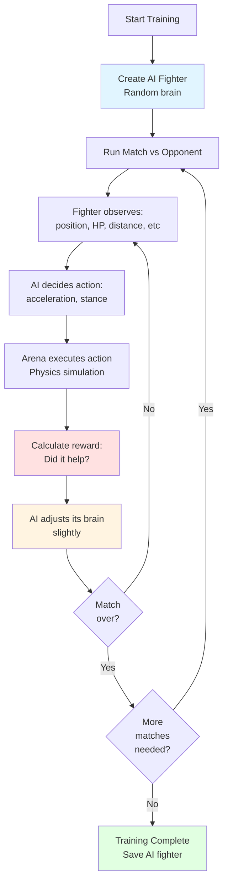

---

## What the AI Fighter "Sees" (Observations)

Every tick (game step), the fighter receives a **snapshot** of the game state:

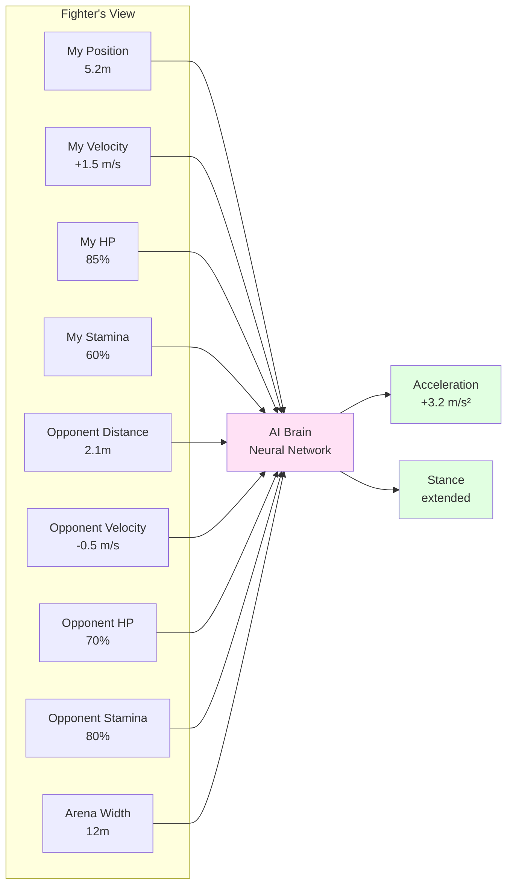

**The fighter only sees these 9 numbers** - it must learn to fight with just this information!

---

## How the AI "Brain" Works

The AI uses a **neural network** - think of it as a mathematical function that transforms observations into actions.

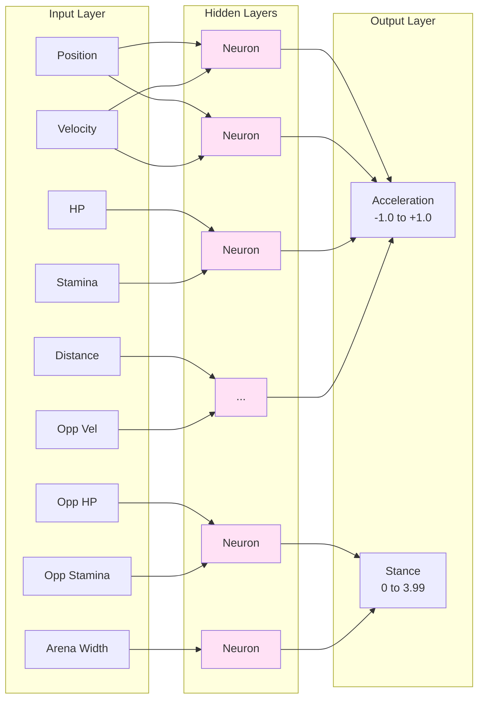

**Key concept:** The network has **weights** (numbers) that determine how it transforms inputs to outputs. Training = adjusting these weights to get better results.

---

## The Reward System: Teaching Right from Wrong

The AI learns by receiving **rewards** (positive numbers = good, negative = bad).

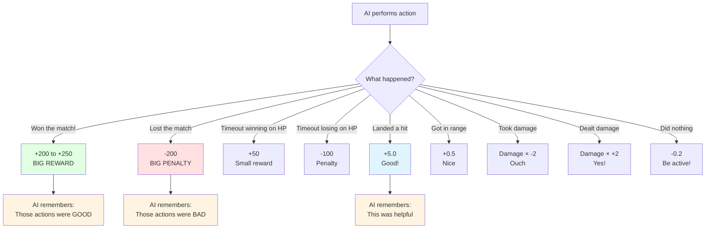

### Current Reward Function

**Episode-ending rewards:**
- ✅ **Win by KO:** +200 + time bonus (faster wins = better)
- ❌ **Loss by KO:** -200
- 😐 **Timeout winning:** +50
- 😞 **Timeout losing:** -100
- 🤷 **Timeout tied:** -25

**Per-tick rewards (during fight):**
- 👊 **Land a hit:** +5.0 (encourages aggression)
- 🎯 **Get in range:** +0.5 if distance < 2m (encourages engagement)
- 💥 **Damage dealt:** damage × 2.0
- 🩹 **Damage taken:** damage × -2.0
- 😴 **No action:** -0.2 (discourages passivity)

---

## The Learning Algorithm (PPO)

We use **PPO (Proximal Policy Optimization)** - a popular algorithm for teaching AI to make decisions.

### How PPO Works (Simplified)

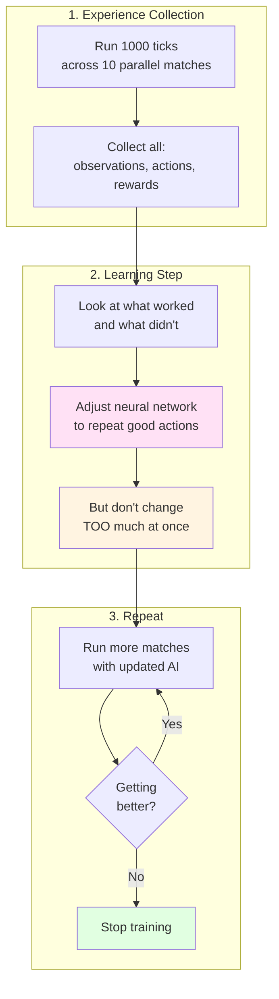

**Key PPO principles:**
1. **Learn from experience:** Try actions, see what happens
2. **Small updates:** Don't change too drastically (prevents forgetting)
3. **Multiple attempts:** Same situations get tried many times
4. **Parallel training:** Run 10 matches at once (faster learning)

---

## Training Stages: What Actually Happens

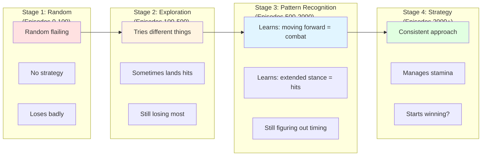

---

## Current Problems and Why Training is Hard

### Problem 1: The Task is Difficult

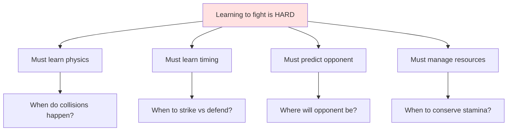

**Why this matters:** The AI starts knowing NOTHING. It must discover these concepts from scratch through trial and error.

### Problem 2: Sparse Rewards

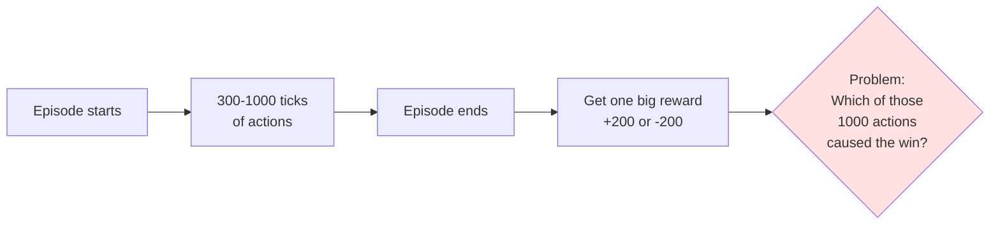

**Current solution:** Dense rewards (per-tick bonuses for hits, range, damage) provide more feedback.

### Problem 3: Exploration vs Exploitation

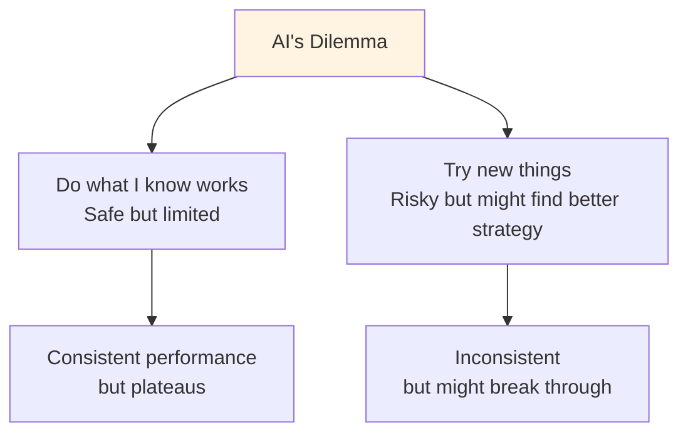

**What we see:** AI finds a "local minimum" strategy (like avoiding combat) and gets stuck.

### Problem 4: Opponent Difficulty

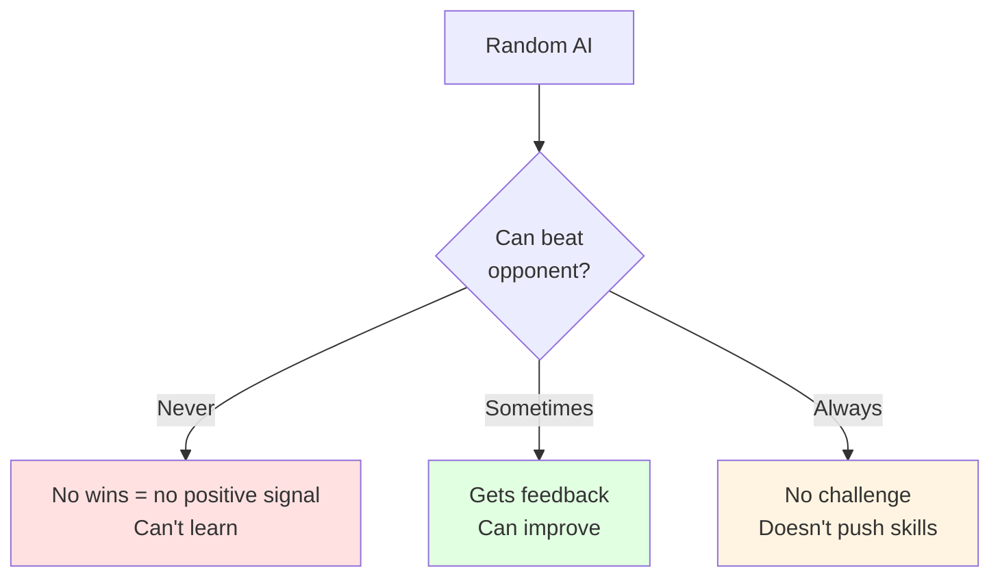

**Current approach:** Train against `training_dummy.py` (stationary, same weight) to give the AI a fighting chance.

---

## Solution: Curriculum Learning (Progressive Difficulty Training)

**The key insight:** Just like humans learn martial arts through progressive difficulty (white belt → black belt), AI fighters learn best when opponents get progressively harder.

### What is Curriculum Learning?

Instead of throwing a random AI against a master fighter (Tank) and hoping it learns, we create a **progression of opponents** from trivial to expert:

```mermaid
graph LR
    L1[Level 1<br/>Training Dummy<br/>Stationary] --> L2[Level 2<br/>Wanderer<br/>Random movement]
    L2 --> L3[Level 3<br/>Bumbler<br/>Poor execution]
    L3 --> L4[Level 4<br/>Novice<br/>Basic competent]
    L4 --> L5[Level 5<br/>Rusher<br/>Aggressive pressure]
    L5 --> L6[Level 6<br/>Tank<br/>Defensive expert]
    L6 --> L7[Level 7<br/>Balanced<br/>Adaptive tactician]
    L7 --> L8[Level 8<br/>Self-Play<br/>vs itself]

    style L1 fill:#e1ffe1
    style L2 fill:#e1ffe1
    style L3 fill:#fff4e1
    style L4 fill:#fff4e1
    style L5 fill:#ffe1e1
    style L6 fill:#ffe1e1
    style L7 fill:#ffe1e1
    style L8 fill:#e1f5ff
```

### The 7-Level Training Curriculum

**Level 1: Training Dummy** (fighters/training_opponents/training_dummy.py)
- **Strategy:** Stands still, does nothing
- **Goal:** Learn basic mechanics (100% win rate)
- **What AI learns:** Movement causes collisions, collisions do damage
- **Expected time:** 500-1000 episodes

**Level 2: Wanderer** (fighters/training_opponents/wanderer.py)
- **Strategy:** Random movement, no fighting logic
- **Goal:** Learn positioning matters (90%+ win rate)
- **What AI learns:** Must track moving target, predict position
- **Expected time:** 1000-2000 episodes

**Level 3: Bumbler** (fighters/training_opponents/bumbler.py)
- **Strategy:** Tries to fight but poor timing/execution
- **Goal:** Learn timing and precision (80%+ win rate)
- **What AI learns:** WHEN you do things matters, not just WHAT
- **Expected time:** 2000-3000 episodes

**Level 4: Novice** (fighters/training_opponents/novice.py)
- **Strategy:** Competent fundamentals, but predictable
- **Goal:** Develop tactics (70%+ win rate)
- **What AI learns:** Must have a strategy, not just reactions
- **Expected time:** 3000-5000 episodes

**Level 5: Rusher** (fighters/examples/rusher.py)
- **Strategy:** Aggressive pressure fighter
- **Goal:** Learn counter-aggression and defense (60%+ win rate)
- **What AI learns:** Must defend, can't just attack
- **Expected time:** 5000-8000 episodes

**Level 6: Tank** (fighters/examples/tank.py)
- **Strategy:** Defensive counter-puncher
- **Goal:** Break through defense (55%+ win rate)
- **What AI learns:** Must force openings, patience required
- **Expected time:** 8000-12000 episodes

**Level 7: Balanced** (fighters/examples/balanced.py)
- **Strategy:** Adaptive tactician (adjusts to situation)
- **Goal:** Adapt to changing situations (50%+ win rate)
- **What AI learns:** Must read opponent and adjust strategy
- **Expected time:** 10000-15000 episodes

**Level 8: Self-Play**
- **Strategy:** Fight against copies of itself
- **Goal:** Continuous improvement
- **What AI learns:** Arms race - must keep innovating
- **Expected time:** Ongoing

### How to Train Through the Curriculum

**Step 1: Train against Level 1**
```bash
cd training
python train_fighter.py \
  --opponent ../fighters/training_opponents/training_dummy.py \
  --output fighter_level1 \
  --episodes 1000 \
  --cores 8 \
  --create-wrapper
```

**Step 2: Test graduation criteria**
```bash
# Run 10 matches to check win rate
cd ..
for i in {1..10}; do
  python atom_fight.py fighter_level1.py fighters/training_opponents/training_dummy.py --seed $i
done
```

**Step 3: If passing (100% wins), move to Level 2**
```bash
cd training
python train_fighter.py \
  --opponent ../fighters/training_opponents/wanderer.py \
  --output fighter_level2 \
  --episodes 2000 \
  --cores 8 \
  --create-wrapper
```

**Step 4: Repeat until reaching desired level**

### Multi-Opponent Training (Alternative Approach)

Instead of sequential training, train against **multiple difficulty levels** at once:

```bash
cd training
python train_fighter.py \
  --opponents ../fighters/training_opponents/*.py \
  --output versatile_fighter \
  --episodes 10000 \
  --cores 10 \
  --create-wrapper
```

**Pros:**
- Fighter learns to handle variety
- More robust to different styles
- Less manual progression management

**Cons:**
- Slower initial progress (harder average opponent)
- Might plateau at "good enough" against easy opponents
- Less focused skill development

### Why Curriculum Learning Works

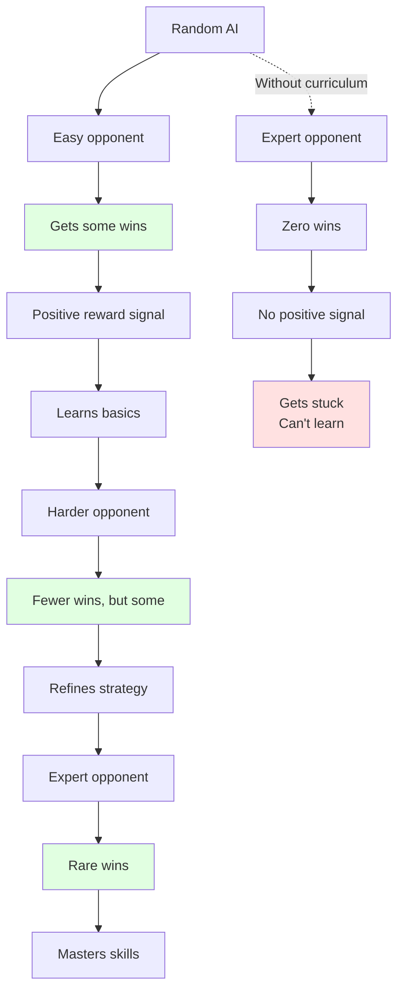

**Key principle:** The AI needs to win SOMETIMES to get positive reinforcement, but not ALWAYS or it won't be challenged to improve.

### Complete Curriculum Guide

See **[fighters/training_opponents/OPPONENT_PROGRESSION.md](../fighters/training_opponents/OPPONENT_PROGRESSION.md)** for the complete curriculum guide with:
- Detailed opponent descriptions
- Graduation criteria for each level
- Training commands
- Expected time estimates
- What each level teaches

---

## Training Configuration

### What You Can Control

| Parameter | What It Does | Trade-off |
|-----------|--------------|-----------|
| `--episodes` | How many matches to run | More = better learning, but slower |
| `--cores` | Parallel matches | More = faster training, uses more CPU |
| `--max-ticks` | Match length limit | Shorter = faster training, but may cut off learning |
| `--opponent` | Who to fight | Easier = faster progress, harder = better final skill |
| `--mass` | Fighter weight | Affects combat style to learn |
| `--patience` | When to stop if not improving | Higher = more thorough, lower = faster completion |

### Recommended Settings

**Quick test (5-10 min):**
```bash
python train_fighter.py \
  --opponent ../fighters/training_opponents/training_dummy.py \
  --output test_ai \
  --episodes 1000 \
  --max-ticks 300 \
  --cores 4
```

**Serious training (1-2 hours):**
```bash
python train_fighter.py \
  --opponent ../fighters/training_opponents/training_dummy.py \
  --output trained_ai \
  --episodes 10000 \
  --max-ticks 500 \
  --cores 10
```

**Multi-opponent training (3-4 hours):**
```bash
python train_fighter.py \
  --opponents ../fighters/training_opponents/training_dummy.py ../fighters/examples/rusher.py \
  --output versatile_ai \
  --episodes 20000 \
  --max-ticks 500 \
  --cores 10
```

---

## What Good Training Looks Like

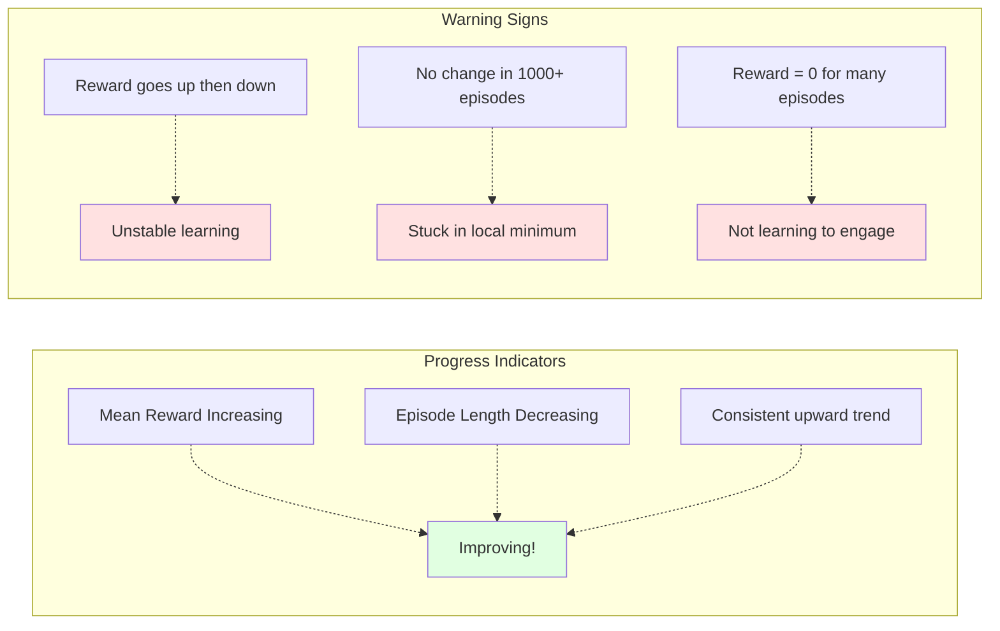

**Example of good training output:**
```
Step 1,000  | Mean Reward: -180.0 ⬆️
Step 5,000  | Mean Reward: -120.0 ⬆️
Step 10,000 | Mean Reward: -60.0 ⬆️
Step 15,000 | Mean Reward: -20.0 ⬆️
Step 20,000 | Mean Reward: +40.0 ⬆️  ← Starting to win!
Step 25,000 | Mean Reward: +120.0 ⬆️
```

---

## What Happens After Training

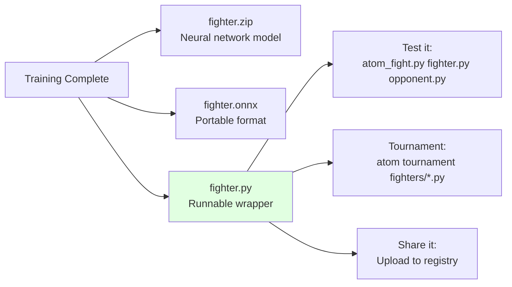

The trained fighter is now a **black box** - you can't see its logic, but you can:
- ✅ Run it in matches
- ✅ Analyze its behavior
- ✅ Use it as an opponent for training others
- ✅ Continue training it further
- ✅ Share it with others

---

## Future: Scaling to Complex Worlds

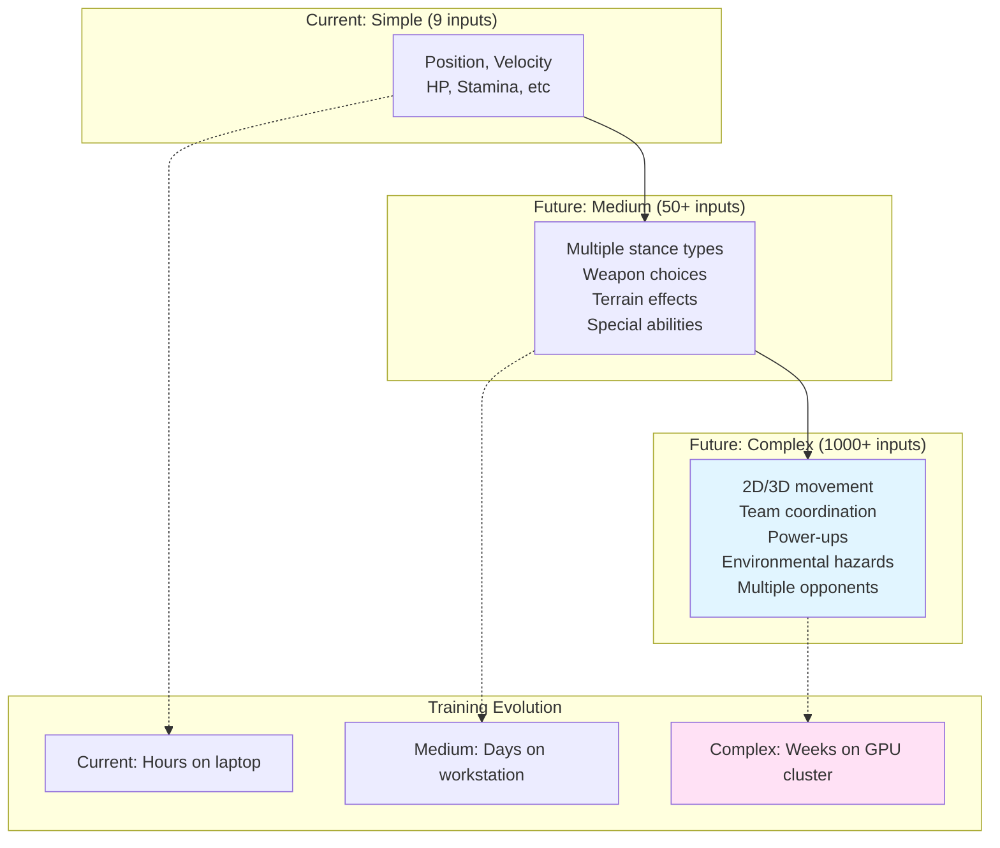

**The path forward:**
1. ✅ Get basic training working (current)
2. Improve reward shaping and training efficiency
3. Add curriculum learning (train on progressively harder opponents)
4. Scale to more complex worlds
5. Eventually: Pro teams with dedicated ML engineers optimizing training pipelines

---

## Key Takeaways

1. **AI fighters learn by trial and error** - no explicit programming
2. **Rewards shape behavior** - what you reward is what you get
3. **Training is hard** - especially with sparse feedback
4. **Current challenge:** Getting AI to learn winning strategies, not just survival
5. **This is a foundation** - as worlds get complex, training will too
6. **Pro leagues will require serious ML expertise** - that's the point!

---

## Next Steps to Improve Training

1. **Better reward shaping** - find the right balance of incentives
2. **Curriculum learning** - start easy, gradually increase difficulty
3. **Self-play** - train against copies of itself
4. **Longer training** - current runs are too short
5. **Hyperparameter tuning** - optimize learning rate, batch size, etc.
6. **Better baselines** - create a hierarchy of opponents (very easy → hard)

The goal: An AI that consistently beats `training_dummy`, then graduates to beating `rusher`, then `tank`, then other trained AIs.
