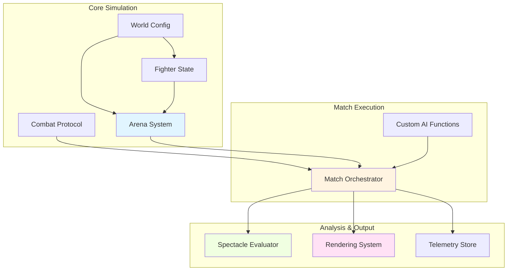
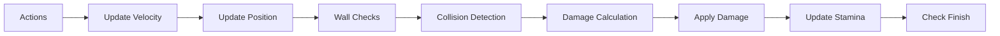
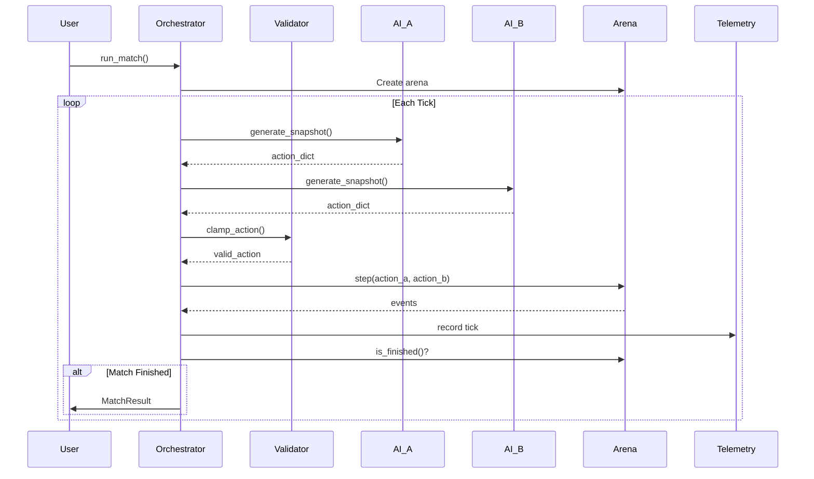
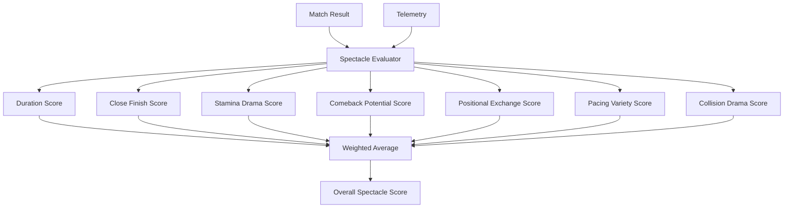
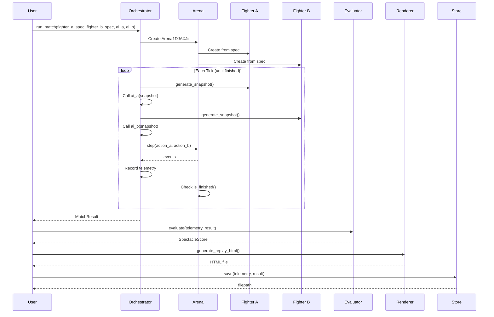
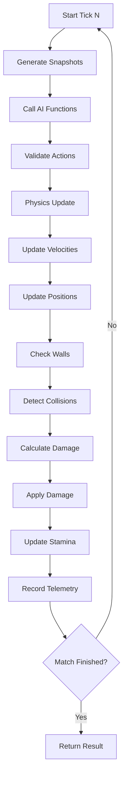

# Atom Combat Platform Architecture

> **A comprehensive guide to the Atom Combat platform components, their responsibilities, and how they work together.**

## Table of Contents

- [Overview](#overview)
- [System Architecture](#system-architecture)
- [Core Components](#core-components)
  - [Arena System](#arena-system)
  - [Protocol Layer](#protocol-layer)
  - [Orchestrator](#orchestrator)
  - [Evaluation System](#evaluation-system)
  - [Rendering System](#rendering-system)
  - [Telemetry System](#telemetry-system)
- [Data Flow](#data-flow)
- [Component Integration](#component-integration)

---

## Overview

Atom Combat is a 1D physics-based combat simulation platform where AI-controlled fighters battle in a constrained arena. The platform is designed with clear separation of concerns, making it easy to:

- **Develop** new fighter AI strategies
- **Evaluate** match quality and entertainment value
- **Visualize** matches in real-time or replay
- **Train** ML models using reinforcement learning
- **Store** and analyze match telemetry

---

## System Architecture



---

## Core Components

### Arena System

**Location:** `src/arena/`

The arena system handles the physics simulation and state management of combat matches.

#### Components:

##### 1. WorldConfig (`world_config.py`)
Defines all physical constants and game rules.

```python
@dataclass
class WorldConfig:
    # Physics
    arena_width: float = 12.4760
    friction: float = 0.3225
    max_acceleration: float = 4.3751
    max_velocity: float = 2.6696
    dt: float = 0.0842  # seconds per tick

    # Stamina economy
    stamina_accel_cost: float = 0.5
    stamina_base_regen: float = 0.03
    stamina_neutral_bonus: float = 3.5

    # Damage
    base_collision_damage: float = 3.1096
    velocity_damage_scale: float = 0.3507
    mass_damage_scale: float = 0.3530

    # Stances
    stances: Dict[str, StanceConfig]
```

**Key Features:**
- ✅ Immutable configuration for reproducibility
- ✅ JSON/YAML serialization support
- ✅ Fighter stat calculation from mass
- ✅ Stance-based combat mechanics

**Usage:**
```python
# Load default optimized config
config = WorldConfig()

# Calculate fighter stats from mass
stats = config.calculate_fighter_stats(mass=70.0)
# Returns: {"max_hp": 85.2, "max_stamina": 8.9}

# Save/load configurations
config.save_to_json("custom_config.json")
config = WorldConfig.load_from_json("custom_config.json")
```

##### 2. FighterState (`fighter.py`)
Represents a fighter's current state in the match.

```python
@dataclass
class FighterState:
    name: str
    mass: float
    position: float
    velocity: float
    hp: float
    max_hp: float
    stamina: float
    max_stamina: float
    stance: str

    @classmethod
    def create(cls, name: str, mass: float, position: float,
               world_config: WorldConfig) -> 'FighterState':
        """Create fighter with world-calculated stats"""
```

**Responsibilities:**
- Track fighter position, velocity, HP, stamina
- Maintain stance state
- Serialize to dictionary for telemetry

##### 3. Arena1DJAXJit (`arena_1d.py`)
The main physics engine that executes combat simulation.

```python
class Arena1DJAXJit:
    def __init__(self, fighter_a: FighterState, fighter_b: FighterState,
                 config: WorldConfig, seed: int = 42):
        """Initialize arena with two fighters"""

    def step(self, action_a: Dict, action_b: Dict) -> List[Dict]:
        """Execute one tick of simulation, return events"""

    def is_finished(self) -> bool:
        """Check if match has ended"""

    def get_winner(self) -> str:
        """Get winner name or 'draw'/'ongoing'"""
```

**Physics Simulation Steps:**
1. **Apply Actions** - Process acceleration and stance changes
2. **Update Velocity** - Apply acceleration and friction
3. **Update Position** - Move fighters based on velocity
4. **Handle Walls** - Detect and resolve wall collisions
5. **Detect Collisions** - Check if fighters are close enough to collide
6. **Calculate Damage** - Compute damage based on mass, velocity, stances, stamina
7. **Apply Damage** - Reduce HP, track events
8. **Update Stamina** - Drain from actions, regenerate over time
9. **Check Finish** - Determine if match has ended



**Key Features:**
- ✅ Mass-based damage calculation
- ✅ Stamina affects damage output (0% stamina = 25% damage)
- ✅ Stance-based combat mechanics (extended reach, defending reduces damage)
- ✅ Wall collision handling
- ✅ Deterministic with seed control

---

### Protocol Layer

**Location:** `src/protocol/combat_protocol.py`

The protocol layer provides the interface between fighters and the arena.

#### Components:

##### 1. Action (`Action` dataclass)
Represents a fighter's decision for one tick.

```python
@dataclass
class Action:
    acceleration: float  # -max_acceleration to +max_acceleration
    stance: str          # "neutral", "extended", "retracted", "defending"

    def to_dict(self) -> Dict

    @classmethod
    def from_dict(cls, data: Dict) -> 'Action'
```

##### 2. Snapshot (`generate_snapshot` function)
Provides a fighter's view of the match state.

```python
def generate_snapshot(
    fighter: FighterState,
    opponent: FighterState,
    tick: int,
    arena_width: float
) -> Dict:
    """Generate snapshot from fighter's perspective"""
```

**Snapshot Structure:**
```python
{
    "tick": 42,
    "you": {
        "position": 3.5,
        "velocity": 1.2,
        "hp": 85.0,
        "max_hp": 100.0,
        "stamina": 7.5,
        "max_stamina": 10.0,
        "stance": "neutral"
    },
    "opponent": {
        "distance": 4.2,        # absolute distance
        "velocity": -0.5,        # relative velocity (negative = approaching)
        "hp": 72.0,
        "max_hp": 100.0,
        "stamina": 5.2,
        "max_stamina": 10.0,
        "stance_hint": "extended"
    },
    "arena": {
        "width": 12.5
    }
}
```

**Key Insight:** Relative velocity is calculated such that:
- **Negative** = fighters approaching each other
- **Positive** = fighters separating

##### 3. ProtocolValidator
Validates and clamps actions to legal ranges.

```python
class ProtocolValidator:
    def validate_action(self, action: Action) -> Tuple[bool, str]:
        """Validate action, return (is_valid, error_message)"""

    def clamp_action(self, action: Action) -> Action:
        """Clamp action to valid ranges"""
```

**Validation Rules:**
- Acceleration must be within ±max_acceleration
- Stance must be one of the valid stances
- Invalid actions are clamped, not rejected (graceful degradation)

---

### Orchestrator

**Location:** `src/orchestrator/match_orchestrator.py`

The orchestrator coordinates the entire match lifecycle.



#### Key Responsibilities:

1. **Match Initialization**
   - Create fighters with world-calculated stats
   - Initialize arena with seed
   - Set up telemetry recording

2. **Tick Loop Execution**
   - Generate snapshots for each fighter
   - Call AI decision functions
   - Validate and clamp actions
   - Execute arena step
   - Record telemetry
   - Check for match end

3. **Match Termination**
   - Detect winner (KO, timeout, or draw)
   - Calculate final statistics
   - Return complete MatchResult

#### MatchResult Structure:
```python
@dataclass
class MatchResult:
    winner: str              # Fighter name or "draw" or "timeout"
    total_ticks: int
    final_hp_a: float
    final_hp_b: float
    telemetry: Dict[str, Any]  # Full tick-by-tick data
    events: List[Dict]         # All collision events
```

**Crash Handling:** If a fighter's AI crashes, the opponent automatically wins.

---

### Evaluation System

**Location:** `src/evaluator/spectacle_evaluator.py`

Evaluates match quality based on entertainment value, not fairness.



#### Evaluation Metrics:

##### 1. **Duration** (0.0 - 1.0)
- **Perfect:** 100-400 ticks
- **Too short:** < 30 ticks (instant KO)
- **Too long:** > 500 ticks (boring slugfest)

##### 2. **Close Finish** (0.0 - 1.0)
Winner's remaining HP percentage:
- **1.0:** < 20% HP (photo finish!)
- **0.9:** 20-40% HP (close call)
- **0.0:** > 80% HP (boring stomp)

##### 3. **Stamina Drama** (0.0 - 1.0)
Percentage of match with critical stamina (< 30%):
- **1.0:** 10-30% of match at critical
- **0.7:** 5-10% at critical
- **0.3:** No stamina drama

##### 4. **Comeback Potential** (0.0 - 1.0)
Number of HP lead changes:
- **1.0:** 3+ lead changes
- **0.8:** 2 lead changes
- **0.5:** 1 lead change
- **0.2:** No lead changes

##### 5. **Positional Exchange** (0.0 - 1.0)
Position swaps (fighters switching sides):
- **1.0:** 5-20% of ticks have swaps
- **0.6:** > 20% (too chaotic)
- **0.0:** No position swaps

##### 6. **Pacing Variety** (0.0 - 1.0)
Speed variance (standard deviation):
- **1.0:** std_dev 0.5-1.5 m/s
- **0.0:** No movement

##### 7. **Collision Drama** (0.0 - 1.0)
Impactful exchanges:
- **1.0:** 8-25 collisions with avg damage > 3.0
- **0.4:** > 25 collisions (wall grinding)
- **0.0:** No collisions

#### Usage:
```python
evaluator = SpectacleEvaluator(weights={
    "duration": 1.0,
    "close_finish": 2.0,      # 2x weight
    "stamina_drama": 1.0,
    "comeback_potential": 1.5,
    "positional_exchange": 1.0,
    "pacing_variety": 1.0,
    "collision_drama": 1.0
})

score = evaluator.evaluate(telemetry, match_result)

print(f"Overall: {score.overall:.3f}")
print(f"Close Finish: {score.close_finish:.3f}")
```

**Philosophy:** The evaluator doesn't care WHO wins, only that the match is entertaining to watch.

---

### Rendering System

**Location:** `src/renderer/`

Two rendering modes for visualizing matches.

#### 1. ASCII Renderer (`ascii_renderer.py`)
Terminal-based live rendering.

```
[Tick 125 |  10.53s]
┌────────────────────────────────────────────────────┐
│                                                    │
│ |----●-----------------▶------------------------|  │
└────────────────────────────────────────────────────┘

     Aggressor            │        Defender
──────────────────────────┼──────────────────────────
HP  ████████████████░░░░  85.2 │ HP  ██████████░░░░░░░░░░  62.5
STA ▓▓▓▓▓▓▓▓▓▓▓▓▓░░░░░░░  6.8  │ STA ▓▓▓▓▓░░░░░░░░░░░░░░░  2.5
Vel +1.23 m/s                   │ Vel -0.45 m/s
Pos  3.45m                      │ Pos  8.92m
Mass 75kg [neutral  ]           │ Mass 65kg [extended]
```

**Features:**
- Live tick-by-tick rendering
- HP/Stamina bars
- Stance visualization (●=neutral, ▶=extended, ◀=retracted, ■=defending)
- Collision notifications
- Playback speed control
- Skip ticks for faster replay

**Usage:**
```python
renderer = AsciiRenderer(arena_width=12.5, display_width=50)

# Live rendering
for tick_data in telemetry["ticks"]:
    renderer.render_tick(tick_data)
    time.sleep(0.0842)  # realtime

# Or play full replay
renderer.play_replay(
    telemetry,
    match_result,
    spectacle_score,
    playback_speed=2.0,  # 2x speed
    skip_ticks=5         # every 5th tick
)
```

#### 2. HTML Renderer (`html_renderer.py`)
Interactive HTML5 canvas replay viewer.

**Features:**
- Standalone HTML file (shareable)
- Play/pause/step controls
- Speed slider (0.25x - 5x)
- Fighter HP/stamina bars
- Velocity indicators
- Match statistics overlay
- Spectacle score visualization

**Generated File Structure:**
```html
<!DOCTYPE html>
<html>
  <head><!-- Styles --></head>
  <body>
    <canvas id="canvas" width="1200" height="600"></canvas>
    <script>
      const REPLAY_DATA = { /* telemetry */ };
      // Animation loop, rendering code
    </script>
  </body>
</html>
```

**Usage:**
```python
renderer = HtmlRenderer()

output_path = renderer.generate_replay_html(
    telemetry,
    match_result,
    output_path="replays/match_001.html",
    spectacle_score=score,
    playback_speed=1.5
)

# Open output_path in browser to watch replay
```

---

### Telemetry System

**Location:** `src/telemetry/replay_store.py`

Persistent storage for match replays and analysis.

#### ReplayStore

```python
class ReplayStore:
    def __init__(self, replay_dir: str = "replays"):
        """Initialize replay directory"""

    def save(self, telemetry: Dict, match_result: MatchResult,
             metadata: Optional[Dict] = None,
             compress: bool = True) -> Path:
        """Save replay to disk"""

    def load(self, filename: str) -> Dict:
        """Load replay from disk"""

    def list_replays(self) -> List[str]:
        """List all available replays"""

    def get_replay_info(self, filename: str) -> Dict:
        """Get metadata without loading full telemetry"""
```

**Replay Data Structure:**
```json
{
  "version": "1.0",
  "timestamp": "2024-11-05T14:32:15.123456",
  "result": {
    "winner": "Champion",
    "total_ticks": 287,
    "final_hp_a": 45.2,
    "final_hp_b": 0.0
  },
  "telemetry": {
    "fighter_a_name": "Champion",
    "fighter_b_name": "Challenger",
    "config": { /* WorldConfig */ },
    "ticks": [
      {
        "tick": 0,
        "fighter_a": { /* state */ },
        "fighter_b": { /* state */ },
        "action_a": { /* action */ },
        "action_b": { /* action */ },
        "events": [ /* collision events */ ]
      },
      // ... more ticks
    ]
  },
  "events": [ /* all collision events */ ],
  "metadata": {
    "tournament": "Finals",
    "round": 3
  }
}
```

**Features:**
- ✅ Gzip compression (default)
- ✅ Auto-generated filenames with timestamp
- ✅ Metadata support for organization
- ✅ Fast metadata lookup without full load
- ✅ Sorted by recency

**Usage:**
```python
store = ReplayStore("replays/")

# Save replay
filepath = store.save(
    telemetry,
    match_result,
    metadata={"tournament": "Finals", "round": 3},
    compress=True
)

# List all replays
replays = store.list_replays()
# ['replay_20241105_143215_Champion_vs_Challenger.json.gz', ...]

# Quick metadata lookup
info = store.get_replay_info(replays[0])
# {'winner': 'Champion', 'total_ticks': 287, ...}

# Load full replay
replay_data = store.load(replays[0])
```

---

## Data Flow

### Complete Match Execution Flow



### Tick Execution Detail



---

## Component Integration

### Building a Complete Application

Here's how all components work together:

```python
from src.atom.runtime.arena import WorldConfig, FighterState, Arena1DJAXJit
from src.atom.runtime.protocol import generate_snapshot
from src.atom.runtime.orchestrator import MatchOrchestrator
from src.atom.runtime.evaluator import SpectacleEvaluator
from src.atom.runtime.renderer import HtmlRenderer, AsciiRenderer
from src.atom.runtime.telemetry import ReplayStore

# Define custom AI functions
def aggressive_ai(snapshot):
    """High-pressure offense strategy"""
    distance = snapshot["opponent"]["distance"]
    stamina_pct = snapshot["you"]["stamina"] / snapshot["you"]["max_stamina"]

    if distance < 1.0 and stamina_pct > 0.3:
        return {"acceleration": 0.0, "stance": "extended"}  # Strike
    elif stamina_pct > 0.6:
        return {"acceleration": 3.0, "stance": "neutral"}   # Rush forward
    else:
        return {"acceleration": 0.0, "stance": "neutral"}   # Recover

def defensive_ai(snapshot):
    """Counter-punching strategy"""
    distance = snapshot["opponent"]["distance"]
    opponent_velocity = abs(snapshot["opponent"]["velocity"])

    if opponent_velocity > 1.5:
        return {"acceleration": 0.0, "stance": "defending"}  # Counter
    elif distance < 2.0:
        return {"acceleration": -2.0, "stance": "retracted"} # Back off
    else:
        return {"acceleration": 1.0, "stance": "neutral"}    # Maintain distance

# 1. Configure world
config = WorldConfig()

# 2. Set up match
orchestrator = MatchOrchestrator(config, max_ticks=1000)

fighter_a_spec = {"name": "Aggressor", "mass": 75.0, "position": 2.0}
fighter_b_spec = {"name": "Defender", "mass": 65.0, "position": 10.0}

# 3. Run match
result = orchestrator.run_match(
    fighter_a_spec,
    fighter_b_spec,
    aggressive_ai,  # AI for fighter A
    defensive_ai,   # AI for fighter B
    seed=42
)

print(f"Winner: {result.winner}")
print(f"Duration: {result.total_ticks} ticks")

# 4. Evaluate spectacle
evaluator = SpectacleEvaluator()
score = evaluator.evaluate(result.telemetry, result)
print(f"Spectacle Score: {score.overall:.3f}")

# 5. Render ASCII (terminal)
ascii_renderer = AsciiRenderer(config.arena_width)
ascii_renderer.render_summary(result, score)

# 6. Generate HTML replay
html_renderer = HtmlRenderer()
html_path = html_renderer.generate_replay_html(
    result.telemetry,
    result,
    "replays/match.html",
    spectacle_score=score
)
print(f"HTML replay: {html_path}")

# 7. Store for later
store = ReplayStore("replays/")
replay_path = store.save(
    result.telemetry,
    result,
    metadata={"ai_a": "aggressive", "ai_b": "defensive"}
)
print(f"Saved replay: {replay_path}")

# 8. Later: Load and replay
replay_data = store.load("replay_20241105_143215_Aggressor_vs_Defender.json.gz")
ascii_renderer.play_replay(
    replay_data["telemetry"],
    # Reconstruct MatchResult from stored data
    playback_speed=2.0
)
```

### Extension Points

The platform is designed for extensibility:

#### 1. Custom AI Strategies
```python
def my_custom_ai(snapshot):
    # Your logic here
    distance = snapshot["opponent"]["distance"]
    my_hp = snapshot["you"]["hp"]

    # Make decisions
    if my_hp < 30:
        return {"acceleration": -4.0, "stance": "defending"}
    elif distance < 2.0:
        return {"acceleration": 0.0, "stance": "extended"}
    else:
        return {"acceleration": 3.0, "stance": "neutral"}
```

#### 2. Custom World Configurations
```python
config = WorldConfig(
    arena_width=20.0,        # Larger arena
    max_acceleration=6.0,    # Faster fighters
    base_collision_damage=5.0  # More damage
)
```

#### 3. ML Training Integration
```python
from training.src.gym_env import AtomCombatEnv

# Define an opponent AI
def opponent_ai(snapshot):
    distance = snapshot["opponent"]["distance"]
    if distance < 2.0:
        return {"acceleration": -2.0, "stance": "defending"}
    else:
        return {"acceleration": 1.0, "stance": "neutral"}

# Wrap as Gymnasium environment
env = AtomCombatEnv(
    opponent_decision_func=opponent_ai,
    config=config
)

# Use with any RL library (Stable-Baselines3, Ray RLlib, etc.)
```

#### 4. Custom Evaluators
```python
evaluator = SpectacleEvaluator(weights={
    "duration": 1.0,
    "close_finish": 3.0,      # Prioritize close finishes
    "collision_drama": 2.0,    # More weight on collisions
    "comeback_potential": 1.5
})
```

#### 5. Tournament Systems
```python
import itertools

# Define your custom fighters
def aggressive_fighter(snapshot):
    distance = snapshot["opponent"]["distance"]
    stamina_pct = snapshot["you"]["stamina"] / snapshot["you"]["max_stamina"]
    if distance < 1.0 and stamina_pct > 0.3:
        return {"acceleration": 0.0, "stance": "extended"}
    return {"acceleration": 3.0, "stance": "neutral"}

def defensive_fighter(snapshot):
    distance = snapshot["opponent"]["distance"]
    if distance < 2.0:
        return {"acceleration": -2.0, "stance": "defending"}
    return {"acceleration": 1.0, "stance": "neutral"}

def balanced_fighter(snapshot):
    distance = snapshot["opponent"]["distance"]
    hp_pct = snapshot["you"]["hp"] / snapshot["you"]["max_hp"]
    if hp_pct < 0.4:
        return {"acceleration": -2.0, "stance": "defending"}
    elif distance < 1.5:
        return {"acceleration": 0.0, "stance": "extended"}
    return {"acceleration": 2.0, "stance": "neutral"}

# Build tournament brackets
fighters = [
    (aggressive_fighter, "Aggressor"),
    (defensive_fighter, "Defender"),
    (balanced_fighter, "Balanced"),
    # ... more fighters
]

results = {}
for (ai_a, name_a), (ai_b, name_b) in itertools.combinations(fighters, 2):
    result = orchestrator.run_match(
        {"name": name_a, "mass": 70.0, "position": 2.0},
        {"name": name_b, "mass": 70.0, "position": 10.0},
        ai_a, ai_b, seed=42
    )
    results[(name_a, name_b)] = result
```

---

## Key Design Principles

### 1. **Separation of Concerns**
Each component has a single, well-defined responsibility:
- **Arena** = Physics simulation
- **Orchestrator** = Match coordination
- **Protocol** = Fighter/arena interface
- **Evaluator** = Match quality assessment
- **Renderer** = Visualization
- **Telemetry** = Data persistence

### 2. **Determinism**
All components support seed-based reproducibility:
- Same seed + same fighters = identical match
- Critical for debugging and testing
- Enables reproducible training

### 3. **Observability**
Complete telemetry capture:
- Every tick recorded
- All events logged
- Full match replay capability
- Analysis-friendly data structures

### 4. **Extensibility**
Clean interfaces for customization:
- Pluggable AI strategies
- Custom world configurations
- Custom evaluation metrics
- Multiple rendering modes

### 5. **Gradual Degradation**
Robust error handling:
- Invalid actions are clamped, not rejected
- Fighter crashes result in automatic forfeit
- Missing telemetry doesn't break rendering

---

## Performance Characteristics

### Memory Usage
- **Full telemetry:** ~1-5 MB per 1000-tick match
- **Compressed replay:** ~200-800 KB per match
- **Minimal mode:** Track only final result (~1 KB)

### Execution Speed
- **Physics simulation:** ~50,000 ticks/second (single core)
- **With telemetry:** ~30,000 ticks/second
- **With rendering:** Limited by display refresh (~60 FPS)

### Scaling
- **Parallel matches:** Fully independent, easily parallelizable
- **Training:** Can run 1000s of matches/second across multiple cores
- **Storage:** 1000 matches ≈ 800 MB compressed

---

## Summary

The Atom Combat platform provides a complete ecosystem for physics-based 1D combat simulation:

- **Accurate physics simulation** with mass, velocity, stamina, and stance mechanics
- **Flexible AI interface** for strategy development and ML training
- **Comprehensive telemetry** for analysis and replay
- **Multiple visualization modes** for debugging and presentation
- **Quality evaluation** for match entertainment assessment
- **Persistent storage** for long-term analysis

All components are designed to work together seamlessly while remaining modular and extensible.

---

**Next Steps:**
- See [PROGRESSIVE_TRAINING.md](./PROGRESSIVE_TRAINING.md) for ML training details
- See [../fighters/examples/NEW_FIGHTERS_GUIDE.md](../fighters/examples/NEW_FIGHTERS_GUIDE.md) for creating custom AI
- See test files in `tests/` for usage examples
